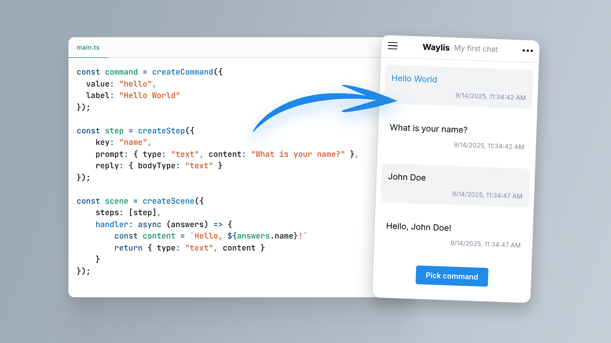

<br>
<p align="center">
  <a href="https://github.com/waylis/core">
    
  </a>
</p>

<h2 align="center">Waylis</h2>
<p align="center">A simple way to interact with your Node.js backend</p>
<p align="center">
🔍 <a href="https://waylis.github.io">Documentation</a>
&nbsp; 🧩 <a href="https://waylis.github.io/examples">Examples</a>
&nbsp; 💻 <a href="https://waylis.yurace.pro/">Live demo</a>
&nbsp; 🚨 <a href="https://github.com/waylis/core/issues/new">Bug report</a>
</p>
<br />



**Waylis** is a Node.js package for interacting with your app’s backend through predefined chat scenes. It’s a complete solution that can free you from writing a separate frontend part. Abstracting user interaction into reusable dialog blocks, Waylis allows you to fully focus on business logic by automatically collecting, validating user input and displaying processing results.

> [!WARNING]
> Waylis is a new project and currently in beta phase. Updates released before version 1.0 may introduce breaking changes.

## Features

-   **Wide range of usage**: from standalone offline tools to online services.
-   **Built-in input validation**: accept only data you need from users (strings, numbers, booleans, dates, files).
-   **Configurable**: comes with flexible server configuration.
-   **Pluggable**: supports custom databases, file storages, loggers by implementing simple interfaces.
-   **No heavy dependencies**: all core functions and the HTTP server are written using only the standard Node.js library.
-   **Minimalistic web UI**: with responsive layout and themes.

## Quick start

Install package from NPM:

```sh
npm install @waylis/core
```

Write some code:

```ts
import { AppServer, createCommand, createScene, createStep } from "@waylis/core";

const command = createCommand({ value: "hello", label: "Hello World" });

const step = createStep({
    key: "name",
    prompt: { type: "text", content: "What is your name?" },
    reply: { bodyType: "text" },
});

const scene = createScene({
    steps: [step],
    handler: async (answers) => {
        return { type: "text", content: `Hello, ${answers.name}!` };
    },
});

const app = new AppServer();
app.addScene(command, scene);
app.start();
```

Run it:

```sh
node ./main.js
```

And see the result on http://localhost:7770

## Contribution

If you have any suggestions, or you have found some kind of bugs, feel free to create an [Issue on GitHub](https://github.com/waylis/core/issues). If you have specific suggestions for making changes to the source code, you can create a [Pull Request](https://github.com/waylis/core/pulls).

## Licence

Released under the [MIT License](http://www.opensource.org/licenses/MIT).
