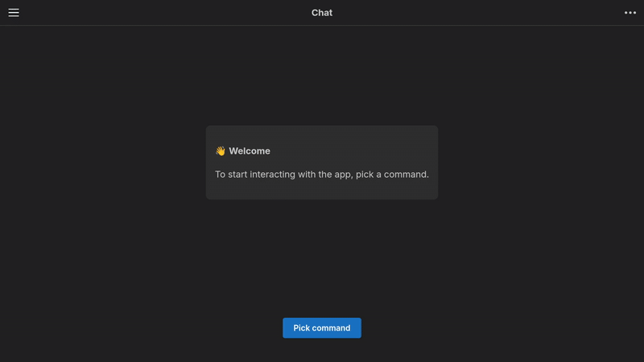

# First steps

To start working with Waylis you need a [Node.js](https://nodejs.org) (version >= 20) and [npm](https://docs.npmjs.com/downloading-and-installing-node-js-and-npm) installed.

## Installation

Install Waylis into your project:

```sh
npm install @waylis/core
```

::: info
It's written on TypeScript, so types are already included.<br>

CommonJS and ESM are both supported.
:::

## Hello world

As usual, let's start with the classic **Hello World** example to check that everything is working as it should:

::: code-group

```ts [main.ts]
import * as w from "@waylis/core";

const command = w.createCommand({ value: "hello", label: "Hello World" });

const step = w.createStep({
    key: "name",
    prompt: { type: "text", content: "What is your name?" },
    reply: { bodyType: "text" },
});

const scene = w.createScene({
    steps: [step],
    handler: async (answers) => {
        return { type: "text", content: `Hello, ${answers.name}!` };
    },
});

const app = new w.AppServer();
app.addScene(command, scene);
app.start();
```

:::

Run a code:

```sh
node ./main.ts
```

You will get something like this:

```
9/13/2025, 12:26:53 PM [INFO] Server is running on http://localhost:7770
```

Once the application is running, open your browser and navigate to http://localhost:7770 and see the result:


