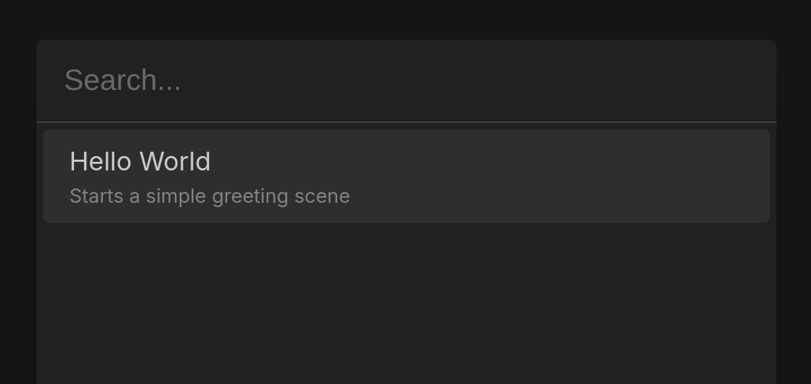

# Commands

Commands are the entry point to functions of your app.

Use [`createCommand`](/api/functions/createCommand) to make a new command:

```ts
import { createCommand } from "@waylis/core";
```

```ts
const command = createCommand({
    value: "hello",
    label: "Hello World",
    description: "Starts a simple greeting scene",
});
```

-   `value` (required) — unique key for identifying the command.
    -   must be 1–32 characters
    -   allowed: lowercase letters (a-z), numbers (0-9), underscores (\_)
-   `label` (optional) — short human-readable name (up to 64 chars).
-   `description` (optional) — longer explanation (up to 512 chars).



Commands are used together with [scenes](/fundamentals/scenes) when [registering on the server](/fundamentals/app-server).
